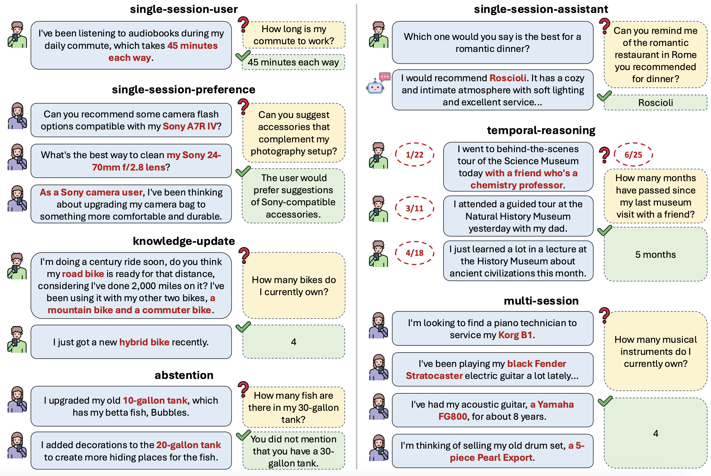

# LongMemEval
<p align="center">
  <a href="https://xiaowu0162.github.io/long-mem-eval/"></a>
  <a href="https://arxiv.org/pdf/2410.10813.pdf"></a>
  <a href="https://huggingface.co/datasets/xiaowu0162/longmemeval-cleaned" ></a>
</p>

🖋 [Di Wu](https://xiaowu0162.github.io/), [Hongwei Wang](https://hongweiw.net/), [Wenhao Yu](https://wyu97.github.io/), [Yuwei Zhang](https://zhang-yu-wei.github.io/), [Kai-Wei Chang](https://web.cs.ucla.edu/~kwchang/), and [Dong Yu](https://sites.google.com/view/dongyu888/)

We introduce LongMemEval, a comprehensive, challenging, and scalable benchmark for testing the long-term memory of chat assistants. 

## 🧠 LongMemEval Overview

We release 500 high quality questions to test five core long-term memory abilities:
* Information Extraction
* Multi-Session Reasoning
* Knowledge Updates
* Temporal Reasoning
* Abstention



 Inspired by the "needle-in-a-haystack" test, we design an attribute-controlled pipeline to compile a coherent, extensible, and timestamped chat history for each question. LongMemEval requires chat systems to parse the dynamic interactions online for memorization, and answer the question after all the interaction sessions.

## ⚠️ News

* [2025/09] We have further cleaned up the history sessions to prevent interference on answer correctness. The updated benchmark can be found [here](https://huggingface.co/datasets/xiaowu0162/longmemeval-cleaned/) and the change logs can be found [here](https://docs.google.com/spreadsheets/d/16cHPu2B4XhgC-VvolIoWNs8wwm0Zkbpgu8H9x-qhxWg/edit?usp=sharing). You may also access the file at this google drive [link](https://drive.google.com/file/d/1zo5C2sKsN3-2TUZt7kiRd2wsZLmyd-4y/view?usp=sharing).
* [2025/02] LongMemEval is accepted at ICLR 2025. 
* [2024/10] Benchmark released.

## 🛠️ Setup

### Data

The LongMemEval dataset is officially released at [huggingface](https://huggingface.co/datasets/xiaowu0162/longmemeval-cleaned). Please download and uncompress the data to the `data/` folder. 
```
mkdir -p data/
cd data/
wget https://huggingface.co/datasets/xiaowu0162/longmemeval-cleaned/resolve/main/longmemeval_oracle.json
wget https://huggingface.co/datasets/xiaowu0162/longmemeval-cleaned/resolve/main/longmemeval_s_cleaned.json
wget https://huggingface.co/datasets/xiaowu0162/longmemeval-cleaned/resolve/main/longmemeval_m_cleaned.json
cd ..
```

### Environment

We recommend using a conda environment for the project. You may follow the steps below to set up.

#### Evaluation only

If you only need to calculate the metrics on the outputs produced by your own system, you can install this minimal requirement set which allows you to run `src/evaluation/evaluate_qa.py`.

```
conda create -n longmemeval-lite python=3.9
conda activate longmemeval-lite
pip install -r requirements-lite.txt
```

#### Full support

If you also would like to run the memory systems introduced in the paper, please set up this environment instead. 

```
conda create -n longmemeval python=3.9
conda activate longmemeval
pip install torch==2.3.1 torchvision==0.18.1 torchaudio==2.3.1 --index-url https://download.pytorch.org/whl/cu121
pip install -r requirements-full.txt
```
We have tested this environment on a Linux machine with CUDA 12.1. If you use a different platform, you may need to modify the requirements.

## 📜 Dataset Format

Three files are included in the data package:
* `longmemeval_s.json`: The LongMemEval_S introduced in the paper. Concatenating all the chat history roughly consumes 115k tokens (~40 history sessions) for Llama 3. 
* `longmemeval_m.json`: The LongMemEval_M introduced in the paper. Each chat history contains roughly 500 sessions. 
* `longmemeval_oracle.json`: LongMemEval with oracle retrieval. Only the evidence sessions are included in the history. 

Within each file, there are 500 evaluation instances, each of which contains the following fields:
* `question_id`: the unique id for each question.
* `question_type`: one of `single-session-user`, `single-session-assistant`, `single-session-preference`, `temporal-reasoning`, `knowledge-update`, and `multi-session`. If `question_id` ends with `_abs`, then the question is an `abstention` question. 
* `question`: the question content.
* `answer`: the expected answer from the model.
* `question_date`: the date of the question.
* `haystack_session_ids`: a list of the ids of the history sessions (sorted by timestamp for `longmemeval_s.json` and `longmemeval_m.json`; not sorted for `longmemeval_oracle.json`). 
* `haystack_dates`: a list of the timestamps of the history sessions. 
* `haystack_sessions`: a list of the actual contents of the user-assistant chat history sessions. Each session is a list of turns. Each turn is a direct with the format `{"role": user/assistant, "content": message content}`. For the turns that contain the required evidence, an additional field `has_answer: true` is provided. This label is used for turn-level memory recall accuracy evaluation.
* `answer_session_ids`: a list of session ids that represent the evidence sessions. This is used for session-level memory recall accuracy evaluation.

## 📊 Testing Your System

To test on LongMemEval, you may directly feed the timestamped history to your own chat system, collect the output, and evaluate with the evaluation script we provide. To do so, save the outputs in a `jsonl` format with each line containing two fields: `question_id` and `hypothesis`. Then, you may run the evaluation script through the following command:

```
export OPENAI_API_KEY=YOUR_API_KEY
export OPENAI_ORGANIZATION=YOUR_ORGANIZATION     # may be omitted if your key belongs to only one organization
cd src/evaluation
python3 evaluate_qa.py gpt-4o your_hypothesis_file ../../data/longmemeval_oracle.json
```

Running this script will save the evaluation logs into a file called `[your_hypothesis_file].log`. In this file, each line will contain a new field called `autoeval_label`. While `evaluate_qa.py` already reports the averaged scores, you can also aggregate the scores from the log using the following command:

```
(assuming you are in the src/evaluation folder)

python3 print_qa_metrics.py gpt-4o your_hypothesis_file.log ../../data/longmemeval_oracle.json
```

## 💬 Creating Custom Chat Histories 

LongMemEval supports compiling a chat history of arbitrary length for a question instance, so that you can easily scale up the difficulty over `LongMemEval_M`.

### Downloading the Corpus

Please download the compressed data from [this link](https://drive.google.com/file/d/1loTKBdywbCfYL5h5zwfnVcqlh7QwnBQm/view?usp=sharing) and uncompress the data under `data/custom_history`. The released data contains three parts:
* `1_attr_bg/data_1_attr_bg.json`: user attibutes and backgrounds. 
* `2_questions`: questions, answers, evidence statements, as well as the evidence sessions. 
* `5_filler_sess/data_5_filler_sess.json`: filler sessions sourced from ShareGPT and UltraChat. 
* `6_session_cache/data_6_session_cache.json`: simulated user sessions based on facts extracted from the backgrounds. 

### Reproducing LongMemEval's History Compilation

You may run `python sample_haystack_and_timestamp.py task n_questions min_n_haystack_filler max_n_haystack_filler enforce_json_length` to reproduce the history compilation in LongMemEval. 

* `task` is the name of the task. In the released data, we used a different naming compared to the paper. Here is the mapping.

    | Name in Data               | Official Name                |
    |----------------------------|------------------------------|
    | single_hop                 | single-session-user          |
    | implicit_preference_v2     | single-session-preference    |
    | assistant_previnfo         | single-session-assistant     |
    | two_hop                    | multi-session                |
    | multi_session_synthesis    | multi-session                |
    | temp_reasoning_implicit    | temporal-reasoning           |
    | temp_reasoning_explicit    | temporal-reasoning           |
    | knowledge_update           | knowledge-update             |

* `n_questions` is the maximum number of questions used. 
* `min_n_haystack_filler` and `max_n_haystack_filler` sets limits on the number of sessions included in the history. 80 is used for `longmemeval_s` and 500 is used for `longmemeval_m`. 
* `enforce_json_length` is used to limit the length of the chat history. 115000 is used for `longmemeval_s`. For `longmemeval_m`, this criteria is not used, and you can set it to a large number. 

### Constructing Your Custom History

To construct your own chat history, you may follow the format in `2_questions` and `6_session_cache` to create the questions and evidence sessions. Then, you may run `sample_haystack_and_timestamp.py` with a similar command. 

## 🚀 Running Memory System Experiments

We provide the experiment code for memory retrieval and retrieval-augmented question answering under the folder `src/retrieval` and `src/generation`.

### Preparation

If you would like to test OpenAI models as the reader, please provide your OpenAI organization ID and key in line 33 and 34 of `src/generation/run_generation.sh`. 

If you want to test an open-weight reader LLM, we support it through an OpenAI API emulator locally-served via `vllm`. To start the server, use the following command:
```
cd src/utils
bash serve_vllm.sh GPU MODEL PORT TP_SIZE
```
* `GPU` is a comma-separated list of the GPUs you want to use
* `MODEL` is the alias of the model you want to use. You can view or configure it in `serve_vllm.sh`. 
* `PORT` is the port the server will listen to. It defaults to 8001. If you change the port, make sure it is reflected in `src/generation/run_generation.sh` line 38.
* `TP_SIZE` is the tensor parallel size. It must be smaller than or equal to the number of GPUs specified in GPU.
* If you need to limit the maximum number of tokens due to memory requirements, you can use the following command:
```
bash serve_vllm_with_maxlen.sh GPU MODEL MAXLEN PORT TP_SIZE
```

### Long-Context Generation

To run the long-context generation baseline where the model is provided with the full history, you can use the following commands:
```
cd src/generation
bash run_generation.sh DATA_FILE MODEL full-history-session TOPK [HISTORY_FORMAT] [USERONLY] [READING_METHOD]
```
* `DATA_FILE` is the path to one of the released json files. Note that `longmemeval_s.json` and`longmemeval_oracle.json` are designed to fit into a model with 128k context, but `longmemeval_m.json` is too long for long-context testing.
* `MODEL` is alias of the model you want to use. You can view or configure it in `run_generation.sh`.
* `TOPK` is the maximum number of history sessions provided to the reader. We recommend setting it to a large number (e.g., 1000) to ensure including all the history sessions.
* `HISTORY_FORMAT` is the format to present the history. It can take either `json` or `nl`. We recommend using `json`.
* `USERONLY` removes the assistant-side messages in the prompt. We recommend setting it to `false`. 
* `READING_METHOD` is the reading style. It can take the value `direct`, `con`, or `con-separate`. We recommend `con`, which instructs the model to first extract useful information and then reason over it.

A log file will be generated under the folder `generation_logs/`. You can then follow the instructions above in "Testing Your System" to evaluate the QA correctness.

### Memory Retrieval

To run memory indexing and retrieval on LongMemEval, following the instructions below.

#### Baseline Retrieval

You may use the following command to run the baseline retrieval:
```
cd src/retrieval
bash run_retrieval.sh IN_FILE RETRIEVER GRANULARITY
```
* `IN_FILE`: the path 
* `RETRIEVER`: `flat-bm25`, `flat-contriever`, `flat-stella` (Stella V5 1.5B), or `flat-gte` (gte-Qwen2-7B-instruct). For `flat-stella`, our code requires downloading the model manually from [the original repository](https://huggingface.co/dunzhang/stella_en_1.5B_v5).
* `GRANULARITY`: the value granularity of the memory index, we support `turn` or `session`.

Note that for the dense embedding models, we support multi-GPU retrieval. By default, the code will utilize all the available GPUs. 

The script will output the retrieval results under `retrieval_logs/` and print out the evaluation metrics. You may print out the metrics from the log as well by:
```
python3 src/evaluation/print_retrieval_metrics.py log_file
```

Also note that for evaluating the retrieval, we always skip the 30 abstention instances. This is because these instances generally refer to non-existing events and do not have a ground truth answer location.

#### Index Expansion

To run the experiments with key expansion, download the released key expansion outputs in this [link](https://drive.google.com/file/d/1Y6vImnr_WQZXv4bKzpqPdHMbyoat8b_P/view?usp=sharing) and place the data under the directory `LongMemEval/index_expansion_logs/`. Then, you may run the following command
```
cd src/retrieval
bash run_retrieval.sh IN_FILE RETRIEVER GRANULARITY EXPANSION_TYPE JOIN_MODE CACHE
```
* `EXPANSION_TYPE`: we support `session-summ`, `session-keyphrase`, `session-userfact`, `turn-keyphrase`, `turn-userfact`
* `JOIN_MODE`: we support three modes:
    * `separate`: add a new (key, value) pair with the expansion as the key.
    * `merge`: merge the expansion and the original key to get the new key.
    * `replace`: replace the original key with the expansion content.
* `CACHE`: the path to the cache file corresponding to `EXPANSION_TYPE`.

We release the code for generating the key expansion outputs offline under `src/index_expansion` for your reference.

#### Time-Aware Query Expansion

We provide the implementation for pruning out the search space by extracting timestamped events from the sessions, inferring time rage from the query, and using the range to narrow down the search space. First, download the extracted timestamped events [here](https://drive.google.com/file/d/1ekTMgHPffoaBQV3ZOuv-qV9fW6wJj4eW/view?usp=sharing) and unzip the data under `LongMemEval/index_expansion_logs/`. Next, run the command
```
cd src/index_expansion
python3 temp_query_search_pruning.py TIMESTAMP_EVENT_FILE RETRIEVAL_LOG GRANULARITY
```
* `TIMESTAMP_EVENT_FILE` is the extracted timestamped events file you downloaded.
* `RETRIEVAL_LOG` is the output from any retrieval experiment.
* `GRANULARITY` is `session` or `turn` and should be consistent with the other two arguments. For the paper, we used `session` as the granularity.

### Retrieval-Augmented Generation

You may use the following command for question answering with the retrieved memory.

```
cd src/generation
bash run_generation.sh RETRIEVAL_LOG_FILE MODEL EXP TOPK [HISTORY_FORMAT] [USERONLY] [READING_METHOD]
```
* `RETRIEVAL_LOG_FILE` should be the output from the retrieval step. Specifically, this step relies on the `retrieval_results` field added in the retrieval step.
* `EXP` should be in the form `[RETRIEVER]-[GRANULARITY]` such as `flat-stella-session`. 
* The other parameters are the same as introduced above.

## Citation

If you find the work useful, please cite:

```
@article{wu2024longmemeval,
      title={LongMemEval: Benchmarking Chat Assistants on Long-Term Interactive Memory}, 
      author={Di Wu and Hongwei Wang and Wenhao Yu and Yuwei Zhang and Kai-Wei Chang and Dong Yu},
      year={2024},
      eprint={2410.10813},
      archivePrefix={arXiv},
      primaryClass={cs.CL},
      url={https://arxiv.org/abs/2410.10813}, 
}
```
